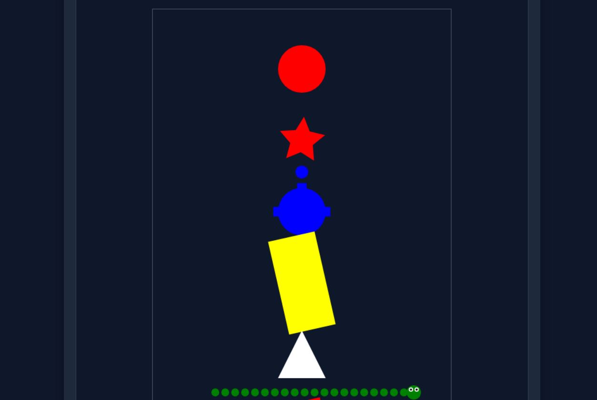
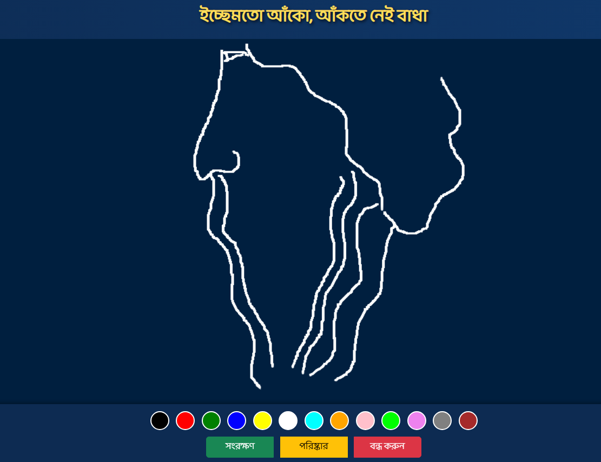

# বাংলা কোড রানার
**`বাংলা কোড রানার`** একটি অনলাইন অ্যাডভান্সড বাংলা কোডিং প্ল্যাটফর্ম যা ব্যবহারকারীদের বাংলা কোড রান এবং টেস্ট করার সুযোগ দেয়। এটি ছোটদের জন্য মজার টুল যা বাংলা কোড লেখা, রান করা এবং ছবি আঁকা যায়।
## সংস্করণ: ৪.২ ভার্সন
---


> **```News```** - [**```Programming24 School```**](https://programming24.school.blog/2025/08/26/bangla-code-runner-version-4-1-released)


> **```লাইভ পেইজ```** -
[**```Try it out```**](https://anisurrahmanju.github.io/bangla-code-runner/)

> [```পতাকা();```](https://github.com/ikrum/potaka) ```থেকে অনুপ্রাণিত।```

>  **```Docs```** -
[**```ডকুমেন্টেশন```**](docs/ডকুমেন্টেশন.md)

```py
// Input/Output
ধরি নাম = ইনপুট("তোমার নাম কি?")
দেখাও("তোমাকে স্বাগতম " + নাম);
```
```py
// Input
ধরি নাম = ইনপুট("তোমার নাম কি?")

// Condition
যদি (নাম == "আনিছুর") {
দেখাও("হ্যালো আনিছুর");
} নাহলে যদি (নাম == "লিখন") {
দেখাও("হ্যালো লিখন");
} নাহলে {
দেখাও("ঘোড়ার ডিম! তোমার নাম কি?");
}
```
## `কথা_বলো() `
```py
// Speak in Bangla
// বাংলায় কথা বলতে পারবে 🗣️...
ফাংশন বলো(){
ধরি নাম = ইনপুট ("তোমার নাম বাংলায় লেখো: ")
কথা_বলো ("তুমি কেমন আছো? " + নাম )
দেখাও(নাম);
}
বলো();
```
---
## `আঁকো()`
> **`আঁকো()`** হলো একটি ভিজুয়াল গ্রাফিক্স। তোমরা ইচ্ছে করলে ছবি আঁকতে পারো। যেমন- `বৃত্ত`, `আয়তক্ষেত্র`, `বর্গক্ষেত্র`, `ত্রিভুজ`, `তারা`,`কচ্ছপ`, `সাপ`, `মানুষ`, `বাড়ি`, `গাড়ি`, `হৃদয়`, `পঞ্চভুজ` ইত্যাদি।
 



```py
আঁকো("বৃত্ত", "লাল",);
আঁকো("তারা", "লাল", "ঘোরাও");
আঁকো("কচ্ছপ", "নীল");
আঁকো("আয়তক্ষেত্র", "হলুদ", "ঘোরাও");
আঁকো("ত্রিভুজ", "সাদা")
আঁকো("বর্গক্ষেত্র", "লাল", "ঘোরাও");
আঁকো("সাপ", "সবুজ", "লাফাও");
// কন্ডিশন ও লুপ দিয়ে কাজ করা যায়।
// উদাহরণে দেখে নাও।
```
---
## `আঁকার_বোর্ড`

> `আঁকার_বোর্ড` ইচ্ছেমতো আঁকো, আঁকতে নেই বাধা।

```py
আঁকো("আঁকার_বোর্ড");
// ইচ্ছেমতো আঁকো, আঁকতে নেই বাধা।
```




## `সাপ খেলা`
```py
আঁকো("সাপ_খেলা");
//↕️↔️ Arrow ব্যবহার করে সাপ খেলা খেলো।
```

>**```Examples```** - [**```উদাহরণ```**](https://github.com/AnisurRahmanJU/bangla-code-runner/tree/main/examples)

