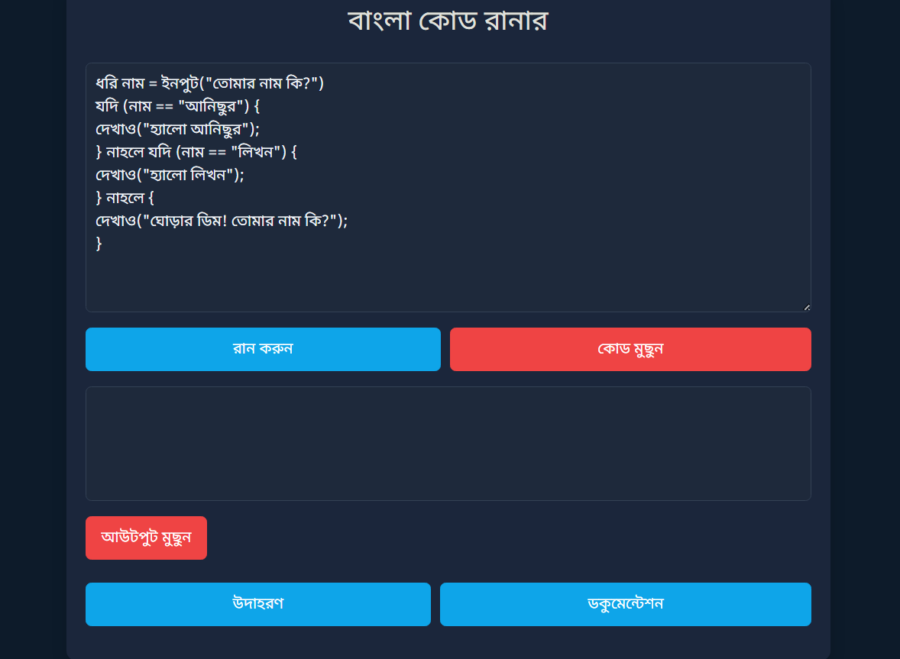

# বাংলা কোড রানার


বাংলা কোড রানার একটি অনলাইন বাংলা কোডিং প্ল্যাটফর্ম যা ব্যবহারকারীদের বাংলা কোড রান এবং টেস্ট করার সুযোগ দেয়। এটি ছোটদের জন্য মজার একটি সহজ এবং কার্যকরী টুল, যা বাংলা কোড লেখা, রান করা এবং ডিবাগ করা আরও সহজ করে তোলে।
> **```News```** - [**```Programming24 School```**](https://programming24.school.blog/%e0%a6%ac%e0%a6%be%e0%a6%82%e0%a6%b2%e0%a6%be-%e0%a6%aa%e0%a7%8d%e0%a6%b0%e0%a7%8b%e0%a6%97%e0%a7%8d%e0%a6%b0%e0%a6%be%e0%a6%ae%e0%a6%bf%e0%a6%82-%e0%a6%ad%e0%a6%be%e0%a6%b7%e0%a6%be/)

> **```লাইভ পেইজ```** -
[**```Try it out```**](https://anisurrahmanju.github.io/bangla-code-runner/)

> [```পতাকা();```](https://github.com/ikrum/potaka) ```থেকে অনুপ্রাণিত।```

```py
// Input/Output
ধরি নাম = ইনপুট("তোমার নাম কি?")
দেখাও("তোমাকে স্বাগতম " + নাম);
```

> **```Docs```** -
[**```ডকুমেন্টেশন```**](docs/ডকুমেন্টেশন.md)

```py
// Input
ধরি নাম = ইনপুট("তোমার নাম কি?")

// Condition
যদি (নাম == "আনিছুর") {
দেখাও("হ্যালো আনিছুর");
} নাহলে যদি (নাম == "লিখন") {
দেখাও("হ্যালো লিখন");
} নাহলে {
দেখাও("ঘোড়ার ডিম! তোমার নাম কি?");
}
```
```py
// Speak in English
// ইংরেজিতে কথা বলতে পারবেন 🗣️...
ফাংশন বলো(){
ধরি নাম = ইনপুট ("তোমার নাম ইংরেজিতে লেখো: ")
কথা_বলো ("How are you? " + নাম )
দেখাও(নাম);
}
বলো();
```

> **```বাংলা কোডের উদাহরণ```** -
[**```Examples```**](https://github.com/AnisurRahmanJU/bangla-code-runner/tree/main/examples)

