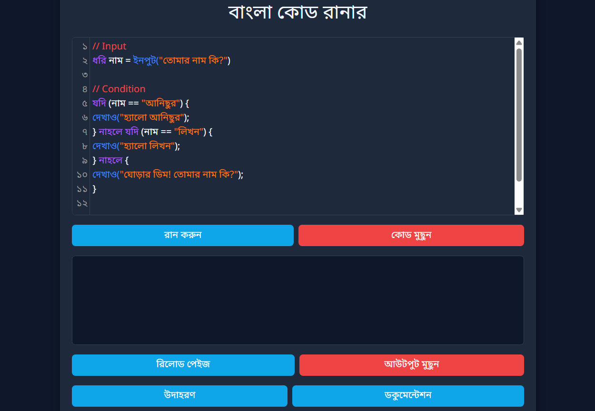

# বাংলা কোড রানার


বাংলা কোড রানার একটি অনলাইন প্ল্যাটফর্ম যা ব্যবহারকারীদের বাংলা কোড রান এবং টেস্ট করার সুযোগ দেয়। এটি ছোটদের জন্য একটি সহজ এবং কার্যকরী টুল, যা বাংলা কোড লেখা, রান করা এবং ডিবাগ করা আরও সহজ করে তোলে।

### লাইভ

> [**Try it out**](https://anisurrahmanju.github.io/bangla-code-runner/)

# ইনস্টলেশন

বাংলা কোড রানার লোকালি সেটআপ করতে নিচের ধাপগুলো অনুসরণ করুন:

এটি নিশ্চিত করুন যে ```Node.js```এবং ```npm (Node Package Manager)``` আপনার সিস্টেমে ইনস্টল রয়েছে কি না? যদি না থাকে, তবে [nodejs.org](https://nodejs.org/) থেকে ডাউনলোড ও ইনস্টল করুন।

# ধাপসমূহ:

1. **রিপোজিটরি ক্লোন করুন:**
   টার্মিনাল বা কমান্ড প্রম্পট ওপেন করুন এবং নিচের কমান্ডটি রান করুন:
   ```bash
   git clone https://github.com/anisurrahmanju/bangla-code-runner.git

2. **প্রোজেক্ট ডিরেক্টরিতে যান:**
   রিপোজিটরি ক্লোন হওয়ার পর, প্রোজেক্টের ডিরেক্টরিতে চলে যান:

   ```bash
   cd bangla-code-runner
   ```

3. **প্রয়োজনীয় ডিপেনডেন্সি ইনস্টল করুন:**
   নিচের কমান্ডটি রান করুন:

   ```bash
   npm install
   ```

4. **লোকালি প্রোজেক্ট রান করুন:**
   ইনস্টলেশন সম্পন্ন হলে, প্রোজেক্টটি লোকালি চালু করতে:

   ```bash
   npm start
   ```

এটি আপনার ব্রাউজারে `http://localhost:3000` এ প্রোজেক্ট চালু করবে।

# ব্যবহারের পদ্ধতি

লোকালি প্রোজেক্ট চালু করার পর এটি ব্যবহার করতে:

1. **অ্যাপটি ব্রাউজারে ওপেন করুন:**
   আপনার ব্রাউজারে `http://localhost:3000` ভিজিট করুন।

2. **বাংলা কোড লিখুন:** এডিটর উইন্ডোতে আপনার বাংলা কোড লিখুন।

3. **কোড রান করুন:** ```রান করুন``` বাটনে ক্লিক করে কোডটি এক্সিকিউট করুন। আউটপুটটি এডিটরের নিচে প্রদর্শিত হবে।

4. **কোড মুছুন:** কোড মুছতে বা ডিলিট করতে চাইলে ```কোড মুছুন``` বাটনে ক্লিক করুন।
5. **আউটপুট মুছুন** আউটপুট মুছতে বা ডিলিট করতে চাইলে ```আউটপুট মুছুন``` বাটনে ক্লিক করুন।
   

# রিপোজিটরি ক্লোনিং

রিপোজিটরি ক্লোন করে প্রোজেক্টে অবদান রাখতে চাইলে:

1. রিপোজিটরি URL কপি করুন:

   ```bash
   https://github.com/anisurrahmanju/bangla-code-runner.git
   ```

2. গিট ব্যবহার করে রিপোজিটরি ক্লোন করুন:

   ```bash
   git clone https://github.com/anisurrahmanju/bangla-code-runner.git
   ```

1. **রিপোজিটরি ফর্ক করুন:**
   গিটহাব পেজে ওপেন করে “Fork” বাটনে ক্লিক করুন।

2. **নতুন ব্রাঞ্চ তৈরি করুন:**
   ফর্ক করার পর একটি নতুন ব্রাঞ্চ তৈরি করুন:

   ```bash
   git checkout -b feature-name
   ```

3. **পরিবর্তন করুন:**
   প্রয়োজনীয় পরিবর্তন করুন এবং কমিট করুন:

   ```bash
   git commit -am 'Add new feature'
   ```

4. **আপনার পরিবর্তন পুশ করুন:**
   পরিবর্তনগুলো পুশ করুন:

   ```bash
   git push origin feature-name
   ```

5. **পুল রিকোয়েস্ট তৈরি করুন:**
   আপনার পরিবর্তন পুশ করার পর, পুল রিকোয়েস্ট খুলুন এবং মূল রিপোজিটরিতে মার্জ করার জন্য আবেদন জানান।

# লাইসেন্স

এই প্রোজেক্টটি MIT লাইসেন্সের অধীনে লাইসেন্সপ্রাপ্ত।


